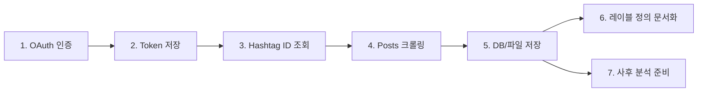

# Hashtag Posts Crawler WebApp (Python)

**Instagram Graph API를 이용해 특정 해시태그를 사용한 사용자 게시물을 수집하고, 사후 분석 준비까지 지원하는 웹앱**
앱 검증용 스크린샷·문서 포함

---

## 📋 목차
1. [프로젝트 개요](#프로젝트-개요)
2. [전체 작업 과정](#전체-작업-과정)
3. [환경 및 사전 준비](#환경-및-사전-준비)
4. [설치 및 실행](#설치-및-실행)
5. [인증 & 앱 검증 요건](#인증--앱-검증-요건)
6. [코드 예시](#코드-예시)
   - 해시태그 ID 조회
   - 해시태그 기반 사용자 게시물 호출
7. [워크플로우 다이어그램](#워크플로우-다이어그램)
8. [로그 포맷 정의](#로그-포맷-정의)
9. [레이블 정의](#레이블-정의)
10. [디렉토리 구조](#디렉토리-구조)
11. [기여 가이드](#기여-가이드)
12. [라이선스](#라이선스)

---

## 1. 프로젝트 개요
- **목적**
  - Instagram Graph API로 특정 해시태그를 사용한 **사용자 게시물**(미디어) 정보를 수집
  - 수집 데이터: 날짜, 사용자 정보, 게시물 내용(caption), 미디어 링크 등
- **핵심 기능**
  - OAuth2 인증 & Long‑Lived Token 발급
  - 해시태그 ID 검색 → 페이징 크롤링 → DB 저장
  - 로그 기록(앱 검증용)
  - 추후 레이블 정의 문서화

---

## 2. 전체 작업 과정
1. 앱 등록 & OAuth 승인 요청
2. Long‑Lived Token 발급 & 저장
3. 해시태그 ID 조회
4. 해시태그 기반 사용자 게시물 호출
5. 수집 데이터(날짜·사용자·내용·링크) DB/파일 저장
6. 레이블 정의(`docs/label-definitions.md`)
7. 사후 분석(텍스트 마이닝, 네트워크 분석 등) 준비
8. 앱 검증 제출용 스크린샷·문서 준비

---

## 3. 환경 및 사전 준비
- **Python ≥ 3.9**
- **Instagram Developer Account**
  - 승인된 권한: `instagram_basic`, `pages_show_list`, `instagram_manage_insights`
- **환경변수** (`.env`)
  ```bash
  IG_CLIENT_ID=your_app_id
  IG_CLIENT_SECRET=your_app_secret
  IG_REDIRECT_URI=https://your-domain.com/auth/callback
  IG_BUSINESS_ID=your_ig_business_account_id
  IG_LONG_LIVED_TOKEN=your_long_lived_token

## 4. 설치 및 실행

```bash
git clone https://github.com/ORG/hashtag-posts-crawler.git
cd hashtag-posts-crawler

python -m venv venv
source venv/bin/activate
pip install -r requirements.txt

cp .env.example .env
# .env에 환경변수 설정

uvicorn app.main:app --reload

```

---

## 5. 인증 & 앱 검증 요건

- **OAuth2 흐름**
    1. `/auth/login` → Instagram 동의 화면
    2. `/auth/callback` → `code` 수신 → 토큰 교환
- **앱 검증용 문서**
    - 이 README.md
    - `docs/app-review.md` (정책 준수 체크리스트)
    - 주요 Postman 요청·응답 스크린샷

---

## 6. 코드 예시

### 6.1 해시태그 ID 조회

```python
import os, requests

INSTAGRAM_ACCOUNT_ID = os.getenv("IG_BUSINESS_ID")
ACCESS_TOKEN         = os.getenv("IG_LONG_LIVED_TOKEN")

def get_hashtag_id(hashtag: str) -> str:
    url = "https://graph.facebook.com/v17.0/ig_hashtag_search"
    params = {
        "user_id": INSTAGRAM_ACCOUNT_ID,
        "q": hashtag,
        "access_token": ACCESS_TOKEN,
    }
    resp = requests.get(url, params=params)
    resp.raise_for_status()
    data = resp.json().get("data", [])
    if not data:
        raise ValueError(f"No hashtag ID found for '{hashtag}'")
    return data[0]["id"]

```

### 6.2 해시태그 기반 사용자 게시물 호출

```python
def fetch_hashtag_posts(hashtag_id: str, limit: int = 50) -> list[dict]:
    url = f"https://graph.facebook.com/v17.0/{hashtag_id}/recent_media"
    params = {
        "fields": "id,caption,permalink,media_type,timestamp,username",
        "access_token": ACCESS_TOKEN,
        "limit": limit,
    }
    resp = requests.get(url, params=params)
    resp.raise_for_status()
    return resp.json().get("data", [])

if __name__ == "__main__":
    tag_id = get_hashtag_id("korea")
    posts = fetch_hashtag_posts(tag_id, 25)
    for p in posts:
        print(p["timestamp"], p["username"], p["permalink"], p.get("caption","")[:40])

```

---

## 7. 워크플로우 다이어그램



---

## 8. 로그 포맷 정의

앱 검증용 로그 예시(JSON)

```json
{
  "timestamp": "2025-07-28T18:00:00+09:00",
  "endpoint": "/17841562420007458/recent_media",
  "status_code": 200,
  "response_time_ms": 150,
  "items_count": 25,
  "error": null
}

```

| 필드 | 설명 |
| --- | --- |
| `timestamp` | ISO8601 형식 요청 시각 |
| `endpoint` | 호출 엔드포인트 |
| `status_code` | HTTP 응답 코드 |
| `response_time_ms` | 응답 소요 시간 (밀리초) |
| `items_count` | 반환된 아이템 개수 |
| `error` | 오류 메시지 (실패 시) |

---

## 9. 레이블 정의

- 레이블(분류 기준)은 별도 문서(`docs/label-definitions.md`)에서 상세화
- 예시
    - `media_type`별 분류 (IMAGE, VIDEO)
    - `시간대`별 태깅 (morning, afternoon…)
    - 해시태그 텍스트 마이닝용 키워드 레이블 등

---

## 10. 디렉토리 구조

```
.
├── app/
│   ├── main.py          # FastAPI 서버 진입점
│   ├── auth.py          # OAuth2 로직
│   ├── crawler.py       # get_hashtag_id, fetch_hashtag_posts
│   └── models.py        # Pydantic & DB 모델
├── docs/
│   ├── app-review.md    # 앱 검증용 체크리스트
│   └── label-definitions.md
├── scripts/             # (사후 분석 스크립트 모음)
├── tests/               # 유닛 테스트
├── .env.example
├── requirements.txt
└── README.md

```

---

## 11. 기여 가이드

1. 저장소 Fork
2. `feature/your-feature` 브랜치 생성
3. `flake8` → `pytest` 통과
4. PR 생성 → 리뷰 → Merge

---

## 12. 라이선스

MIT © 2025 Your Name

```

이 README.md를 기반으로, `docs/label-definitions.md`에서 레이블 체계를 정의하고, 앱 검증용 스크린샷을 `docs/app-review.md`에 추가하시면 완성도가 높아집니다. 추가 수정이 필요하시면 알려주세요!

```
